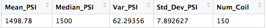

# MechaCar_Statistical_Analysis

## Background

A few weeks after starting his new role, Jeremy is approached by upper management about a special project. AutosRUs’ newest prototype, the MechaCar, is suffering from production troubles that are blocking the manufacturing team’s progress. AutosRUs’ upper management has called on Jeremy and the data analytics team to review the production data for insights that may help the manufacturing team.

In this challenge, you’ll help Jeremy and the data analytics team do the following:

- Perform multiple linear regression analysis to identify which variables in the dataset predict the mpg of MechaCar prototypes
- Collect summary statistics on the pounds per square inch (PSI) of the suspension coils from the manufacturing lots
- Run t-tests to determine if the manufacturing lots are statistically different from the mean population
- Design a statistical study to compare vehicle performance of the MechaCar vehicles against vehicles from other manufacturers. For each statistical analysis, you’ll write a summary interpretation of the findings.

## Deliverable 1: Linear Regression to Predict MPG

The linear regression model I created predicts MPG of MechaCar prototypes by using vehicle weight and length, spoiler angle, ground clearance and if it has AWD or not.
Here are my results:

### Which variables/coefficients provided a non-random amount of variance to the mpg values in the dataset?
Coefficients vehicle length and ground clearance are statistically mopre likely to generate non-random amounts of variance. This means those two variables are highly impactful to the MPG on the MechaCar.  The other variables have p-values that suggest they have a randion amount of variance with the dataset.

### Is the slope of the linear model considered to be zero? Why or why not?
The slope of the linear model is not considered to be zero because the p-value is less than 0.05. 

### Does this linear model predict mpg of MechaCar prototypes effectively? Why or why not?
This model has an r-squared value of 0.7149 which means this regression model does predict the MPG of MechaCar accurately 71% of the time.

## Deliverable 2: Create Visualizations for the Trip Analysis

Here is what the total summary for manufacturing lots looks like:
  
 

Here is a deeper dive into each of the lots:
  

